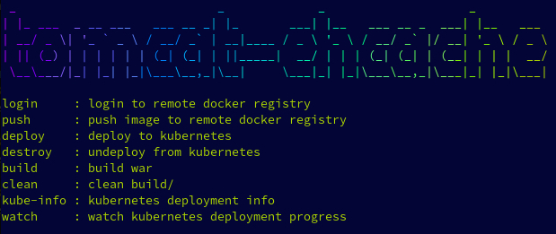

#                                                  

##### This project shows how to configure a simple servlet to run on Tomcat in Kubernetes with distributed session replication and Ehcache/Terracotta

###### Configurations:
 - [src/main/resources/ehcache.xml](src/main/resources/ehcache.xml)
  
This is the servlet Ehcache implementation basic configuration file. Not distributed, test only [^1]

 <!-- - [src/main/resources/ehcache.distributed.xml](src/main/resources/ehcache.distributed.xml)  -->
 - [terracotta/tc-cluster.cfg](terracotta/tc-cluster.cfg) 

This is the test Terracotta server configuration file. [^2]

#### Running make will list build targets

- DOCKER_REGISTRY 

Define environment variable $DOCKER_REGISTRY for the container registry used.

###### Local testing/Cluster testing tools

- [tc.local](tc.local)

This runs a local Terracotta server for development testing after downloading and extracting the artifacts in [terracota/download.sh](terracota/download.sh)

- [tc.activate](tc.activate)
  
Before the Terracotta server can be used, it must first be activated! [^3]

After activation it goes from this state:
```log
2023-06-01 00:05:31,938 INFO - Moved to State[ DIAGNOSTIC ]
```
To this state:
```log
2023-06-01 00:05:55,299 INFO - Moved to State[ ACTIVE-COORDINATOR ]
```
The test config is sufficient to configure caches for testing.

- [cli.newsession](cli.newsession)
  
This calls the server at $TARGET (default localhost) to create a new session

- [cli](cli)

After a session is created, this call the server at $TARGET (default localhost) to continue to use the session created previously.

---
###### Sample output:
```json
~/tomcat-ehcache(main) $ ./cli.newsession 
calling 10.2.2.150
HTTP/1.1 200 OK
Content-Length: 117
Date: Thu, 01 Jun 2023 08:03:10 GMT
Set-Cookie: JSESSIONID=0DAE4A4296258B39BBD7E577E392D1B3; Path=/; HttpOnly
Content-Type: text/plain; charset=utf-8

{"count":1,"localName":"tomcat-ehcache-6b696f8cd-5s5lg","localName":"10.42.3.7","localPort":"8080","cachedEntry":"1"}
~/tomcat-ehcache(main) $ ./cli
calling 10.2.2.150
# Netscape HTTP Cookie File
# https://curl.se/docs/http-cookies.html
# This file was generated by libcurl! Edit at your own risk.

#HttpOnly_10.2.2.150	FALSE	/	FALSE	0	JSESSIONID	0DAE4A4296258B39BBD7E577E392D1B3
HTTP/1.1 200 OK
Content-Length: 117
Date: Thu, 01 Jun 2023 08:03:17 GMT
Content-Type: text/plain; charset=utf-8

{"count":2,"localName":"tomcat-ehcache-6b696f8cd-rtrtn","localName":"10.42.1.9","localPort":"8080","cachedEntry":"2"}
~/tomcat-ehcache(main) $ ./cli
calling 10.2.2.150
# Netscape HTTP Cookie File
# https://curl.se/docs/http-cookies.html
# This file was generated by libcurl! Edit at your own risk.

#HttpOnly_10.2.2.150	FALSE	/	FALSE	0	JSESSIONID	0DAE4A4296258B39BBD7E577E392D1B3
HTTP/1.1 200 OK
Content-Length: 118
Date: Thu, 01 Jun 2023 08:03:20 GMT
Content-Type: text/plain; charset=utf-8

{"count":3,"localName":"tomcat-ehcache-6b696f8cd-g6rlv","localName":"10.42.2.11","localPort":"8080","cachedEntry":"3"}
~/tomcat-ehcache(main) $ ./cli
calling 10.2.2.150
# Netscape HTTP Cookie File
# https://curl.se/docs/http-cookies.html
# This file was generated by libcurl! Edit at your own risk.

#HttpOnly_10.2.2.150	FALSE	/	FALSE	0	JSESSIONID	0DAE4A4296258B39BBD7E577E392D1B3
HTTP/1.1 200 OK
Content-Length: 117
Date: Thu, 01 Jun 2023 08:03:21 GMT
Content-Type: text/plain; charset=utf-8

{"count":4,"localName":"tomcat-ehcache-6b696f8cd-5s5lg","localName":"10.42.3.7","localPort":"8080","cachedEntry":"4"}
~/tomcat-ehcache(main) $ ./cli
calling 10.2.2.150
# Netscape HTTP Cookie File
# https://curl.se/docs/http-cookies.html
# This file was generated by libcurl! Edit at your own risk.

#HttpOnly_10.2.2.150	FALSE	/	FALSE	0	JSESSIONID	0DAE4A4296258B39BBD7E577E392D1B3
HTTP/1.1 200 OK
Content-Length: 117
Date: Thu, 01 Jun 2023 08:03:22 GMT
Content-Type: text/plain; charset=utf-8

{"count":5,"localName":"tomcat-ehcache-6b696f8cd-rtrtn","localName":"10.42.1.9","localPort":"8080","cachedEntry":"5"}

```
---
#### Kubernetes deployments
[k8s/k8s-role.yaml](k8s/k8s-role.yaml)
Kubernetes role, used to allow Tomcat to call Kubernetes API to get member list of other pods in the same namespace.

[k8s/k8s-deployment.yaml](k8s/k8s-deployment.yaml) 
Kubernetes deployment, set to create 3 replicas for testing.[^4]

[k8s/k8s-ingress.yaml](k8s/k8s-ingress.yaml) 
Kubernetes ingress, used to expose deployment externally.[^5]

[^1]: Ehcache [Config](https://www.ehcache.org/documentation/3.10/107.html)

[^2]: Terracotta [Reference](https://documentation.softwareag.com/terracotta/terracotta_10-11/webhelp/index.html)

[^3]: Terracotta [Config Tool](https://documentation.softwareag.com/terracotta/terracotta_10-11/webhelp/index.html#page/terracotta-db-webhelp%2Fco-srv_config_intro.html%23)

[^4]: Kubernetes [Deployment](https://kubernetes.io/docs/concepts/workloads/controllers/deployment/)

[^5]: Kubernetes [Ingress](https://kubernetes.io/docs/concepts/services-networking/ingress/)
